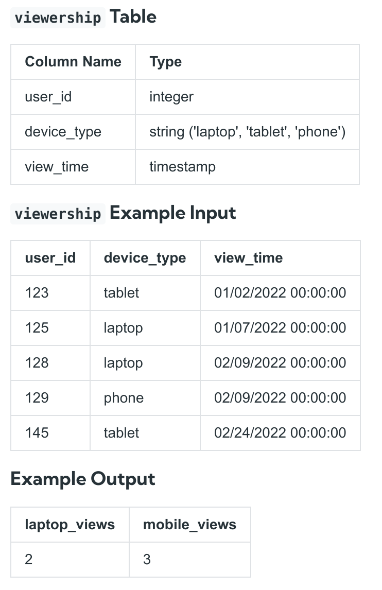

# SQL queries:

## 1. Laptop vs. Mobile Viewership [New York Times SQL Interview Question]

https://datalemur.com/questions/laptop-mobile-viewership

This is the same question as problem #3 in the SQL Chapter of Ace the Data Science Interview!

Assume you're given the table on user viewership categorised by device type where the three types are laptop, tablet, and phone.

Write a query that calculates the total viewership for laptops and mobile devices where mobile is defined as the sum of tablet and phone viewership. Output the total viewership for laptops as laptop_reviews and the total viewership for mobile devices as mobile_views.

Effective 15 April 2023, the solution has been updated with a more concise and easy-to-understand approach.



Explanation
Based on the example input, there are a total of 2 laptop views and 3 mobile views.

The dataset you are querying against may have different input & output - this is just an example!

### Solution:

```sql
SELECT
  SUM(CASE WHEN device_type='laptop' THEN 1 ELSE 0 END) as laptop_reviews,
  SUM(CASE WHEN device_type in ('tablet', 'phone') THEN 1 ELSE 0 END) as mobile_views
FROM viewership;

```

### Remark

The SQL query you're asking about is aggregating data across the entire `viewership` table without the need for a `GROUP BY` clause. This might initially seem confusing if you're used to seeing `GROUP BY` used with aggregation functions like `SUM()`. Let's break down why `GROUP BY` is not necessary in this particular query.

In SQL, `GROUP BY` is used when you want to aggregate data into groups based on one or more columns. For example, if you wanted to get the total number of views for each `device_type`, you would use `GROUP BY device_type` to separate the counts for laptops, tablets, phones, etc.

However, the query you've provided does not aim to separate the results by any column. Instead, it calculates two sums across the entire table:

1. **laptop_reviews**: This calculates the total number of rows where `device_type` is 'laptop'. It does so by adding 1 for each row where `device_type` is 'laptop' (because of the `THEN 1` in the `CASE` statement) and 0 otherwise.

2. **mobile_views**: Similarly, this calculates the total number of rows where `device_type` is either 'tablet' or 'phone'. It adds 1 for each row meeting that criteria, and 0 otherwise.

Since these calculations are intended to produce a single total sum for each condition across the entire dataset (and not sums within groups of data), there is no need for a `GROUP BY` clause. The result will be a single row with two columns: `laptop_reviews` and `mobile_views`, each showing the total counts according to their respective conditions.

The essence here is that the query is designed to aggregate over the entire table without distinguishing between different groups of `device_type`, which is why `GROUP BY` is unnecessary.
