# Qwen3.5 pure-torch inference — function call graph

This document traces the function call hierarchy invoked from
`python qwen3_5_torch.py --image … --prompt …` down to the tensor-level
primitives (softmax, SwiGLU, Gated DeltaNet, RoPE, …).

Two views are provided:

1. **ASCII tree** — quickest to read top-to-bottom.
2. **Mermaid graph** — renders in GitHub / VS Code preview.

The corresponding math and papers for each node live in the docstring of
the function itself.

---

## 1. ASCII tree (prefill + decode)

```
main()                                                          qwen3_5_torch.py
│
├── parse_args()
├── _resolve_device() / _resolve_dtype()
│
├── Qwen2Tokenizer.from_pretrained()                            tokenizer.py
├── Qwen2VLImageProcessor.from_pretrained()                     image_processor.py
├── Qwen3_5Config.from_pretrained()                             config.py
│
├── Qwen3_5ForConditionalGeneration(config)                     model.py
│     └── Qwen3_5Model(config)
│           ├── Qwen3_5VisionModel(config.vision_config)        vision.py
│           │     ├── Qwen3_5VisionPatchEmbed   (Conv3d)
│           │     ├── VisionRotaryEmbedding     (2D RoPE)       rotary.py
│           │     └── Qwen3_5VisionBlock × depth
│           │           ├── RMSNorm                             layers.py
│           │           ├── Qwen3_5VisionAttention
│           │           │     ├── apply_rotary_pos_emb_vision   rotary.py
│           │           │     └── packed SDPA (cu_seqlens)
│           │           └── Qwen3_5VisionMLP
│           │                 └── ACT2FN (GELU / tanh-GELU)     layers.py
│           │     └── Qwen3_5VisionPatchMerger  (2×2 merge)
│           │
│           └── Qwen3_5TextModel(config.text_config)            decoder.py
│                 ├── nn.Embedding (embed_tokens)
│                 ├── TextRotaryEmbedding (M-RoPE frequencies)  rotary.py
│                 └── Qwen3_5DecoderLayer × num_hidden_layers
│                       ├── RMSNorm (input_layernorm)
│                       ├── mixer  (one of:)
│                       │     ├── Qwen3_5Attention              attention.py
│                       │     │     ├── RMSNorm (q/k per-head)
│                       │     │     ├── apply_rotary_pos_emb    rotary.py
│                       │     │     │     └── _apply_interleaved_mrope
│                       │     │     ├── repeat_kv (GQA)
│                       │     │     ├── eager_attention
│                       │     │     │     └── softmax(QKᵀ/√d) V
│                       │     │     └── sigmoid output gate
│                       │     │
│                       │     └── Qwen3_5GatedDeltaNet          linear_attention.py
│                       │           ├── causal 1-D conv (q,k,v) [prefill]
│                       │           │     or torch_causal_conv1d_update [decode]
│                       │           ├── l2norm(q), l2norm(k)
│                       │           ├── g_t = -A · softplus(a + dt_bias)
│                       │           ├── β_t = σ(b_t)
│                       │           ├── torch_chunk_gated_delta_rule [prefill]
│                       │           │     or torch_recurrent_gated_delta_rule [decode]
│                       │           └── RMSNormGated (sigmoid gate on output)
│                       │
│                       ├── RMSNorm (post_attention_layernorm)
│                       └── SwiGLUMLP                           layers.py
│                             └── W_down( SiLU(W_gate x) ⊙ W_up x )
│                 └── RMSNorm (final norm)
│
├── load_qwen3_5_weights(model, model_path, …)                  weights.py
│     ├── _iter_shards            (reads model.safetensors.index.json)
│     ├── _remap_key              (strip model.language_model., skip mtp/visual)
│     └── model.load_state_dict
│
├── build_inputs(tokenizer, image_processor, …)                 qwen3_5_torch.py
│     ├── Qwen2Tokenizer.apply_chat_template
│     ├── Qwen2VLImageProcessor._process_one
│     │     ├── smart_resize
│     │     ├── tvF.resize + rescale + normalize
│     │     └── view/permute → flat patches + grid_thw
│     ├── expand_image_placeholders   (N = T·H·W / M²)
│     └── Qwen2Tokenizer.__call__    (encode → input_ids)
│
├── compute_mm_token_type_ids
│
└── generate(model, inputs, …)                                  qwen3_5_torch.py
      ├── HybridCache(layer_types)                              cache.py
      │     ├── FullAttentionState                 (softmax layers)
      │     └── LinearAttentionState               (DeltaNet layers)
      │
      ├── PREFILL:  model(**prefill_kwargs)
      │     └── Qwen3_5ForConditionalGeneration.forward
      │           └── Qwen3_5Model.forward
      │                 ├── get_image_features            (vision tower)
      │                 ├── get_placeholder_mask
      │                 │     └── masked_scatter          (splice embeds)
      │                 ├── get_rope_index                (build M-RoPE position_ids)
      │                 │     ├── get_vision_position_ids
      │                 │     └── compute_3d_position_ids
      │                 └── language_model.forward        (Qwen3_5TextModel)
      │                       ├── _build_causal_mask
      │                       └── decoder_layer(x, cache) × L
      │           └── lm_head  (logits = W_lm · y)
      │
      ├── _sample(logits[-1])                              (greedy / top-p)
      │
      └── DECODE loop (up to max_new_tokens):
            ├── model(input_ids=next_token, past_key_values=cache, use_cache=True)
            │     └── same stack as prefill, but:
            │           – attention layers append 1 col to KV
            │           – DeltaNet layers update conv ring + recurrent state in-place
            ├── _sample(logits[-1])
            └── break on EOS id
```

---

## 2. Mermaid call graph

```mermaid
flowchart TD
    %% entry point
    main[main<br/>qwen3_5_torch.py]

    %% loaders
    main --> parse_args
    main --> tok_from[Qwen2Tokenizer.from_pretrained]
    main --> ip_from[Qwen2VLImageProcessor.from_pretrained]
    main --> cfg_from[Qwen3_5Config.from_pretrained]
    main --> build_model[Qwen3_5ForConditionalGeneration<br/>__init__]
    main --> load_w[load_qwen3_5_weights]
    main --> build_in[build_inputs]
    main --> mm_ids[compute_mm_token_type_ids]
    main --> gen[generate]

    %% preprocessing
    build_in --> apply_chat[Qwen2Tokenizer.apply_chat_template]
    build_in --> img_pre[Qwen2VLImageProcessor._process_one]
    img_pre --> sr[smart_resize]
    img_pre --> norm[rescale + normalize]
    img_pre --> view[view/permute → patches]
    build_in --> expand[expand_image_placeholders<br/>N = T·H·W / M²]
    build_in --> tok_call[Qwen2Tokenizer.__call__]

    %% generate
    gen --> hc[HybridCache]
    gen --> prefill[model.forward prefill]
    gen --> sample_p[_sample]
    gen --> decode_loop[decode loop × T]
    decode_loop --> model_fwd[model.forward single token]
    decode_loop --> sample_d[_sample]

    %% top-level forward
    prefill --> mm[Qwen3_5Model.forward]
    model_fwd --> mm
    mm --> vis[get_image_features<br/>Qwen3_5VisionModel.forward]
    mm --> splice[get_placeholder_mask<br/>+ masked_scatter]
    mm --> rope_idx[get_rope_index]
    mm --> lm_mod[Qwen3_5TextModel.forward]
    mm --> lm_head[lm_head → logits]

    %% vision tower
    vis --> pe[Qwen3_5VisionPatchEmbed<br/>Conv3d]
    vis --> vrope[VisionRotaryEmbedding<br/>2D RoPE]
    vis --> vblocks[Qwen3_5VisionBlock × depth]
    vblocks --> vatt[Qwen3_5VisionAttention]
    vatt --> vrot[apply_rotary_pos_emb_vision]
    vatt --> vsdpa[packed SDPA<br/>cu_seqlens]
    vblocks --> vmlp[Qwen3_5VisionMLP]
    vmlp --> act[ACT2FN GELU / tanh-GELU]
    vis --> merge[Qwen3_5VisionPatchMerger<br/>2x2 merge]

    %% rope index
    rope_idx --> vpos[get_vision_position_ids]
    rope_idx --> pos3d[compute_3d_position_ids]

    %% text stack
    lm_mod --> mask[_build_causal_mask]
    lm_mod --> dec[Qwen3_5DecoderLayer × L]

    dec --> rms_in[RMSNorm input_layernorm]
    dec --> mixer{mixer}
    mixer -->|full_attention| attn[Qwen3_5Attention]
    mixer -->|linear_attention| gdn[Qwen3_5GatedDeltaNet]
    dec --> rms_post[RMSNorm post_attn]
    dec --> mlp[SwiGLUMLP<br/>W_down SiLU Wg ⊙ Wu]

    %% softmax attention
    attn --> qk_norm[RMSNorm q,k per-head]
    attn --> rope_apply[apply_rotary_pos_emb<br/>_apply_interleaved_mrope]
    attn --> gqa[repeat_kv GQA]
    attn --> eager[eager_attention<br/>softmax QKᵀ/√d · V]
    attn --> ogate[sigmoid output gate]

    %% gated deltanet
    gdn --> conv[causal conv1d<br/>or conv1d_update decode]
    gdn --> l2[l2norm q,k]
    gdn --> gates[g = -A·softplus a+dt_bias<br/>β = σ b]
    gdn --> chunk[torch_chunk_gated_delta_rule prefill]
    gdn --> recur[torch_recurrent_gated_delta_rule decode]
    gdn --> rms_g[RMSNormGated sigmoid gate]

    %% cache
    hc --> fas[FullAttentionState ×]
    hc --> las[LinearAttentionState ×]

    %% weight load
    load_w --> shards[_iter_shards]
    load_w --> remap[_remap_key]
```



---

## 3. The hot path, compressed

For a running decode step the hottest sub-path (per token) is:

```
Qwen3_5DecoderLayer.forward
  └─ input_layernorm (RMSNorm)
  └─ mixer
       ├─ Qwen3_5Attention                 (full-attn layers)
       │    QKᵀ / √d → softmax → @V → o_gate
       └─ Qwen3_5GatedDeltaNet             (linear-attn layers)
            conv1d_update → l2norm → recurrent_gated_delta_rule → RMSNormGated
  └─ post_attention_layernorm (RMSNorm)
  └─ SwiGLUMLP: W_down( SiLU(Wg x) ⊙ (Wu x) )
```

and at the top of the loop:

```
lm_head(final_norm(h))  →  _sample  →  next_token
```

Layer pattern is `L-L-L-F` every four layers (three Gated DeltaNet then
one full softmax attention), so for every four decoder layers we pay the
:math:`\mathcal{O}(T)` KV cost only once and the :math:`\mathcal{O}(1)`
recurrent cost three times.
