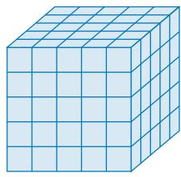
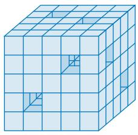
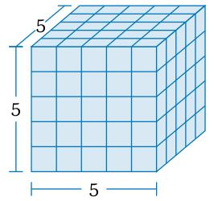
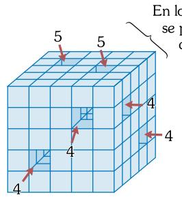
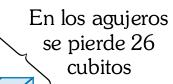
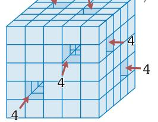
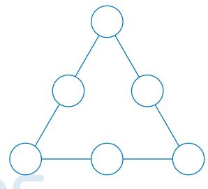
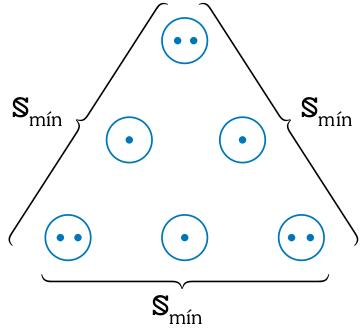

## PREGUNTA N.° 21 

La figura 1 muestra un cubo 5×5×5 formado por cubitos unitarios 1×1×1. El cubo 5×5×5 pesa 500 g y cada cubito unitario tiene el mismo peso. Si al cubo 5×5×5 se le hace seis agujeros desde una cara hasta la otra cara opuesta, como se muestra en la figura 2, ¿cuál es el peso del sólido agujereado? 

 

Figura 1
 

 

Figura 2
 

A) 400 g
B) 392 g
C) 404 g
D) 388 g
E) 396 g 

## RESOLUCIÓN 

**Tema:** Conteo de figuras
Nos piden el peso del sólido agujereado 

 

 

 

En los agujeros se pierde 26 cubitos
 

 

# cubitos 125-26=99
 

Peso x 

Luego: 

\[ \frac{\frac{x^4}{125} - \frac{500}{x}}{\frac{99}{x^4}} = \frac{1}{x} \]

\[\therefore x = 99(4) = 396 \text{ g}\]

## Respuesta: 396 g 

## PREGUNTA N.° 22 

En cada una de las seis casillas circulares de la figura, escriba los seis primeros números pares positivos, uno en cada casilla y sin repetir. Si la suma de los números escritos en las casillas circulares de cada lado del triángulo es la misma y la menor posible, determine dicha suma. 

 

A) 24
B) 20
C) 16
D) 14
E) 18 

## RESOLUCIÓN 

**Tema:** Arreglos numéricos 

Nos piden el mínimo valor de la suma constante.
Números a distribuir: 

\[ 2 + 4 + 6 + 8 + 10 + 12 = 42 \text{ (suma total)} \]

Sea la suma por lado = S 

En el gráfico: 

