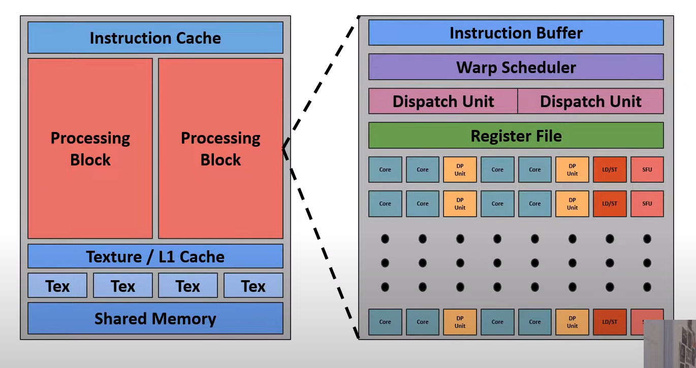

# CUDA Crash Course Cheatsheet

## Key Concepts

### SIMT Model

- Stands for Single Instruction, Multiple Threads
- Enables natural parallel vector addition where a single instruction operates on multiple data elements

### Threads and Warps

- Threads are the smallest execution units
- Warps group threads executing instructions in lockstep (every thread need to finish). They are usually of size 32.
- A thread in a warp is also called `lane`.

### Thread Blocks and Grids

- Threads are organized into thread blocks, which are assigned to shader cores.
- Thread blocks can be arranged in three dimensions (X, Y, Z). These are lowest programmable entity. This are defined by user as a parameter.
- Grids aggregate thread blocks, mapping the entire problem onto the GPU

### Shader cores

### Memory Allocation

- GPUs have their own physical memory
- `CUDA malloc` is used to allocate memory on the GPU

### Memory Transfer

- `CUDA mem copy` transfers data between CPU memory and GPU memory
- Directions include host to device, device to host, and device to device

### Kernel Execution

- Kernels are functions executed on the GPU, marked with `__global__`
- Launch parameters include grid size and thread block size
- A kernel for vector addition would involve calculating each element's addition in parallel

## Cuda functions

- `__shfl_xor_sync(uint32_t(-1), var, lane_mask)`
  A thread inside a warp with lane equals to x, will change the value of its variable `var` with the lane `x+lane_mask`.

## Resources

- https://www.youtube.com/playlist?list=PLxNPSjHT5qvtYRVdNN1yDcdSl39uHV_sU
- https://github.com/NVIDIA/cuda-samples
- https://github.com/CoffeeBeforeArch/cuda_programming
