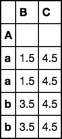

# Pandas

## Import data

### CSV Import
```python
df = pd.read_csv('file_path.csv', sep=',', header="infer")
```

- header is the list of column name 

### EXCEL Import
```python
df = pd.read_excel('file_path.xlsx', sheet_name=0, header=0)
```

- header is the row where it starts read. 

## Info dataframe

### Stats view

```python
df.describe()
```

### Types and non null features

```python
df.info()
```

### Get name columns

```python
print(df.columns)
```

### Get type columns

```python
df.dtypes
```

## Create dataframe

## Modify dataframe

```python
df['col'] = df['col'].replace('value1','value2')
```

### Rename columns

```python
df.rename(columns={"A": "a", "B": "c"})
```

## Reshaping Data

Cast columns

```python
df['col'].astype("int32")
```

```python
df.drop(["col"], axis=1)
```

## Iteration

## Indexing

### Where

```python
df.where((df.col>=1981) & (df.col<=1996))
```

### Query not indexed

```python
df.loc[(df['col1'] == 'val1') & (df['col2'] == 'val2'), 'result_column']
```

To get a default value:
Ex. with None default value. Then return first result, `values` return a numpy ndarray.

```python
df.loc[(df['col1'] == 'val1') & (df['col2'] == 'val2')].get('result_column', None).values[0]
```

### Indexed

```python
df.loc[('index_val1', 'index_val2'), 'result_column']
```

With default value

```python
try:
    val = df.loc[('index_val1', 'index_val2'), 'result_column']
except KeyError:
    val = default_value
```

### Useful select

```python
df['column'].unique()
```

```python
df[['column', 'quantity']].unique()
```

```python
df.sort_values(by=['quantity'], ascending=False)
```

```python
df.drop_duplicates()
```

## Duplicate Data

## Group Data

### Aggregation & transform

consider the dataframe `df`

```python
df = pd.DataFrame(dict(A=list('aabb'), B=[1, 2, 3, 4], C=[0, 9, 0, 9]))
```


---
groupby is the standard use aggregater

```python
df.groupby('A').mean()
```


---
Maybe you want these values broadcast across the whole group and return something with the same index as what you started with.

use transform
```python
df.groupby('A').transform('mean')
```


```python
df.set_index('A').groupby(level='A').transform('mean')
```



---

agg is used when you have specific things you want to run for different columns or more than one thing run on the same column.

```python
df.groupby('A').agg(['mean', 'std'])
```


```python
df.groupby('A').agg(dict(B='sum', C=['mean', 'prod']))
```


---

aggregation selecting one column.

```python
df.groupby(
    [df['date'].dt.year.rename('year'), 
    df['date'].dt.month_name().rename('month')]
    )['rides'].sum().reset_index()
```

aggregation selecting many columns.

```python
big_table.groupby('year')['amount', 'quantity'].agg(
    dict(amount='sum', quantity='count')
)
```

keep all columns after aggregation:

```python
idx = big_table.groupby('Country')["year"].transform(max) == big_table["year"]
big_table = big_table[idx]
```

### List of aggregations

    GroupBy.count()
    GroupBy.first()
    GroupBy.max()
    GroupBy.mean()
    GroupBy.min()
    GroupBy.ngroup([ascending])	Number each group from 0 to the number of groups - 1.
    GroupBy.ohlc()	Compute sum of values, excluding missing values
    GroupBy.prod()
    GroupBy.std([ddof])
    GroupBy.sum()
    GroupBy.var([ddof])

Exhaustive list:
https://pandas.pydata.org/pandas-docs/version/0.22/api.html#id41

## Missing Data

Drop NaN values in current dataframe.

```python
df.dropna(inplace=True)
```

Fill NaN with a predetermined value.

```python
df["col1"].fillna(0.0)
```

## Combining Data

It is better to merge instead of join, because merge allows to select the column key for each dataframe,
however join is faster than merge.

### Merge

```python
new_df = pd.merge(A_df, B_df,  how='left', left_on=['A_c1','c2'], right_on = ['B_c1','c2'])
```

```python
big_table = pd.merge(orders_df, customers_df, how="left", on="customer_id")
```

### Join

Join over the index

```python

joined_df = left.join(right, lsuffix='_')
print(joined_df)
```

Join over columns index, it adds the suffix '_' when a column name is duplicated.

```python
joined_df2 = left.join(right, on='index', lsuffix='_')
print(joined_df2)
```

## Dates

Format:

- %Y - Year   - 2021
- %m - Month  - 03
- %b - Month  - Mar
- %d - Day    - 05
- %H - Hour   - 20
- %M - Minute - 30
- %S - Second - 59

```python
# For format 12/1/2010 8:26
big_table['transacion_date'] = pd.to_datetime(big_table['transacion_date'], format='%d/%m/%Y %H:%M')

```

Get year in one column

```python
big_table['year'] = big_table['transacion_date'].dt.year
```

## Visualization
